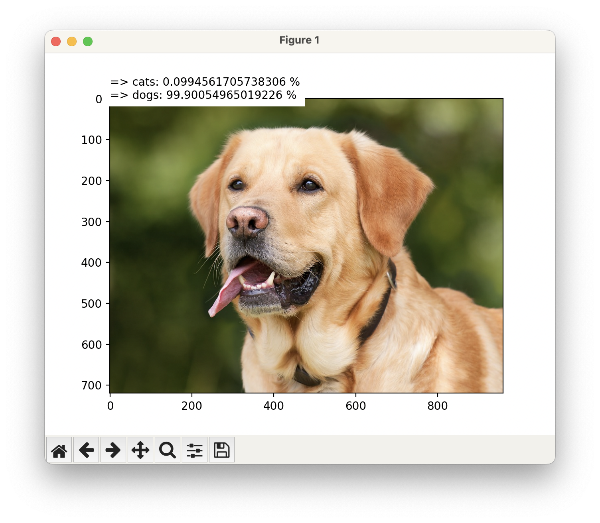
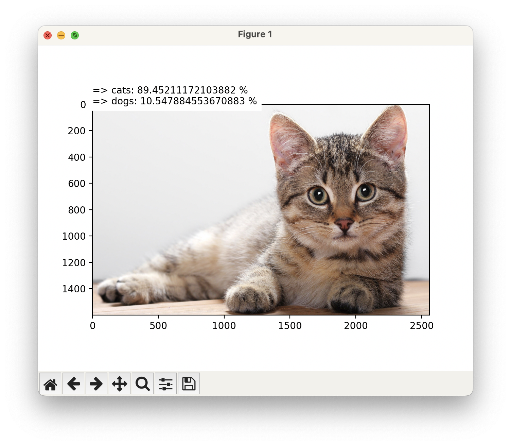

# Basic CNN - Phân loại hình ảnh theo phương pháp tích chập

Dự án nhằm xây dựng một mô hình học sâu dựa trên mạng thần kinh tích chập (Convolutional Neural Network - CNN) để tự
động phân loại các hình ảnh vào các danh mục đã xác định trước.

# Sử dụng

1. Từ thư mục gốc: `nn_reserch/~`
2. Cài đặt thư viện: `pip install -r requirements.txt`
3. Vào thư mục dự án: `cd research/cnn`
4. Chạy dự án: `python basic_cnn.py`
5. Xem kết quả & custom code!
    * Kết quả test 1
      
    * Kết quả test 2
      
